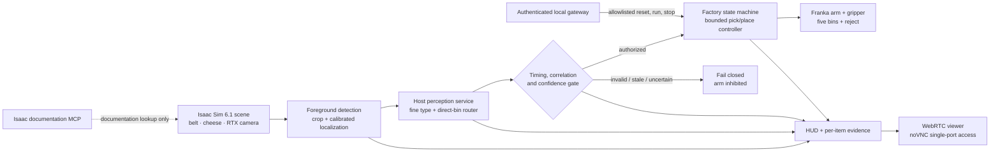

# System architecture and evidence boundaries

The important boundary is the validation gate: a prediction cannot move the arm unless
its request ID, item ID, observation sequence, frame hash, timestamps, status, label and
destination all satisfy the current contract. Missing, malformed, conflicting, stale or
low-confidence results leave the arm inhibited.

The documentation MCP helps a developer query Isaac Sim documentation. It does not
control the runtime. Runtime control is a separate, narrow, authenticated local API with
an audit trail and allowlisted actions.

## Repository ownership

| Layer | Main files | Runs where |
|---|---|---|
| declarative factory layout | `sim/factory/scene_layout.json` | loaded into the USD Stage by Isaac |
| scene and physical objects | `sim/factory/scene.py` | Isaac Sim container |
| camera/perception contract | `sim/factory/perception.py`, `sim/sort_server.py` | Isaac container + host GPU process |
| safety/timing gate | `sim/factory/timing.py` | Isaac Sim container |
| state and manipulation | `sim/factory/state_machine.py`, `controller.py` | Isaac Sim container |
| operator experience | `hud.py`, `runtime_status.py`, `infra/isaac-sim/` | Isaac + browser containers |
| evidence generation | `run-evaluation.sh`, `build_evaluation_report.py` | RTX workstation |

## What each mode proves

| Mode | Route source | Valid evidence | Invalid claim |
|---|---|---|---|
| `model` | trained direct-bin model | current perception and fail-closed full-loop behavior | real-world accuracy or industrial safety |
| `showcase` | known deterministic scenario | camera localization, control, manipulation and presentation | classifier accuracy |
| `development` | rendered-pixel proxy | diagnostics and plumbing | trained perception |
