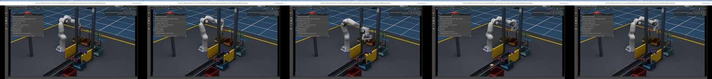

# Judge guide — Physical AI Cheese Factory

## The 90-second pitch

Most robotics demos show a polished success path and hide the boundary between a model
guess and a safe action. This factory makes that boundary observable. An RTX camera sees
each moving item, two trained classifiers propose a cheese type and route, and a timing
and correlation gate decides whether the Franka arm is allowed to move. Every decision,
frame hash, deadline, action and failure is visible in the HUD and saved as evidence.

The novelty is not “AI recognizes cheese.” It is a small, auditable Physical AI system:
synthetic-data generation, perception, uncertainty rejection, camera-to-world
localization, manipulation, browser delivery and authenticated agent control in one
reproducible stack. We also publish the bad news: the current trained model completes
only 4/11 full-loop cases, while the 11/11 visual showcase uses scripted routes and says
so on screen. That honesty makes the next improvement measurable.

## Live demo

```bash
infra/isaac-sim/factory-demo.sh launch showcase
```

Open the printed `READY` URL. Point out, in order:

1. the moving belt, inspection portal, camera, Franka and six visibly separate receivers;
2. `ARM INHIBITED` while an observation is pending;
3. the item ID, route, evidence mode and destination in the HUD;
4. physical approach, grasp, lift, destination release and return;
5. the foreign-object reject with no arm action;
6. the explicit `SCRIPTED ROUTING (NOT MODEL ACCURACY)` boundary.

Then show `docs/evaluation_results.md`: model mode is the honest perception result;
showcase mode is the reliable physical presentation. A continuous captured run is saved
as [`evidence/p23-live-showcase.mp4`](evidence/p23-live-showcase.mp4).



## Why this branch is the integrated product

Both source branch tips are ancestors of `codex/hackathon-integration`; neither was
discarded. The integration adds the following product surface beyond either parent:

| Capability | `work/perception` | `work/isaac-factory` | `codex/hackathon-integration` |
|---|:---:|:---:|:---:|
| dataset pipeline and trained cheese models | yes | no | yes |
| autonomous Isaac arm/factory foundation | partial | yes | yes |
| industrial non-overlapping cell and labelled receivers | no | partial | yes |
| camera-bound model routing with fail-closed disagreement | no | no | yes |
| stale-response/item/frame correlation protection | no | no | yes |
| operator HUD, runtime identity and browser demo | no | partial | yes |
| authenticated, audited, allowlisted control gateway | no | no | yes |
| seeded domain capture and frozen promotion gate | partial | no | yes |
| one-command exact-image launch and artifact provenance | no | no | yes |
| regenerated layered evaluation with uncertainty | no | no | yes |

## Technical differentiators

- Immutable Isaac container digest and checkpoint hashes, not “works on my machine.”
- Stable USD prim hierarchy plus declarative presentation layout for human editing.
- A real safety contract between perception and action, including replay/staleness checks.
- One browser port for remote judging despite WebRTC/UDP restrictions.
- Negative experiments and weak rare-class results are retained instead of cherry-picked.

## Evidence boundaries

This remains simulation. The control gateway is not a safety PLC, the emergency stop is
not safety-rated, synthetic accuracy is not real-world accuracy, and the small Isaac
scenario cannot establish reliability. The project is hackathon-ready because those
limits are explicit, reproducible and visible—not because they have disappeared.
