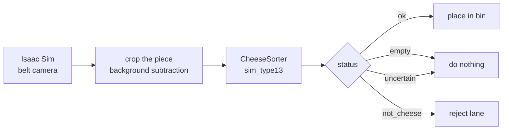

# 🧀 Cheese Factory — Perception

> [!abstract] What this is
> The perception block of the *Physical AI cheese factory* challenge. A belt camera
> frame goes in, a **sorting decision** comes out, and the downstream pipeline drives
> the robot arm.

> [!success] Model to ship — [[sim_type13]]
> One network, three answers: the fine **type** (`emmental_cheese`), the **bin** it
> belongs to (`bin_hard`), and a **status** telling the arm whether to act at all.
> Test top-1 **0.728** on 13 classes · reject accuracy **95.3%**.

> [!warning] Before quoting any number
> Read [[What the numbers do not measure]]. Nothing here has been validated against
> the actual demo scene.

## Reading paths

| if you are… | read, in order |
|---|---|
| **new to the project** | [[Overview]] → [[Data provenance]] → [[Model comparison]] |
| **integrating the robot** | [[Output contract]] → [[Inference API]] → [[Robot pipeline]] |
| **reviewing the science** | [[Splits and data leakage]] → [[Evaluation protocol]] → [[Measurement pitfalls]] |
| **reproducing it** | [[Environment]] → [[Reproduce everything]] |
| **looking for what is broken** | [[Bug log]] → [[Open questions]] |

> [!tip] Visual overview
> Open **[[Pipeline.canvas|Pipeline canvas]]** for the whole project on one board.

## Map of content

- 🧭 [[Overview]] · [[Glossary]] · [[Code map]]
- 🏗 [[System architecture]] · [[Data flow]]
- 📦 [[Datasets MOC]] — three sources, one manifest
- ⚙️ [[Pipeline MOC]] — normalise → cut out → render
- 🔬 [[Methodology MOC]] — recipe, algorithms, metrics
- 🤖 [[Models MOC]] — eight heads trained
- 📊 [[Results MOC]] — comparisons and pitfalls
- 🔌 [[Integration MOC]] — how to call it · [[Sorting line demo]]
- 🛠 [[Ops MOC]] — environment and reproduction
- 📝 [[Decision log]] · [[Bug log]] · [[Open questions]]

## Headline numbers

| | value | note |
|---|---|---|
| images trained on | 12355 renders | [[Isaac Sim rendering]] |
| distinct physical pieces | 3191 | split key, [[Splits and data leakage]] |
| classes | 13 | 11 cheese + 2 reject, [[Class taxonomy]] |
| type top-1 | 0.728 | [[sim_type13]] |
| bin macro-F1 | 0.733 | [[Model comparison]] |
| reject accuracy | 0.953 | [[Reject performance]] |
| inference | ~14 ms | [[Inference API]] |

## Tag index

`#moc` `#dataset` `#pipeline` `#model` `#results` `#integration` `#ops`
`#decision` `#bug` `#gotcha` `#todo` `#ship-it`
