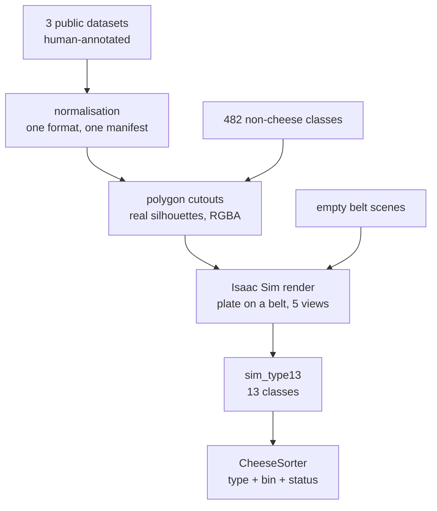

# Overview

> [!info] One page, the whole project

## The problem

Sort cheese on a conveyor belt into bins, from a camera feed, in Isaac Sim.
Three public datasets were suggested. None of them shows cheese on a belt.

## What was built

No image was hand-labelled. Every label rides for free from annotations that already
existed — see [[Data provenance]].

## Artefacts

| artefact | location | size |
|---|---|---|
| normalised real images | `data/processed/images/` | 6486 |
| RGBA cutouts | `data/processed/cutouts/` | 2400 |
| belt renders | `data/processed/images/sim_belt/` | 12355 |
| trained heads | `runs/<name>/best.pt` | 8 |
| ONNX exports | `runs/bin/`, `runs/sim_bin/` | 2 |
| notebook | `hpe.ipynb` (EN), `hpe_fr.ipynb` (FR) | 48 cells |
| this vault | `vault/` | ~35 notes |

## What is solid, and what is not

> [!success] Solid
> - Splits are leak-free and verified — [[Splits and data leakage]]
> - The reject classes work: 95.3% accuracy, perfect on empty belt — [[Reject performance]]
> - Adding reject cost nothing on the cheese task — [[Model comparison]]
> - One model gives type, bin and status in ~14 ms — [[Inference API]]

> [!failure] Not validated
> - **No measurement on the real demo scene.** Everything is renders built from photos.
> - The cheese piece is a **flat decal**, not a volume.
> - `processed_cheese` is never recognised (160 train images).
> - `variety` naming collapses on renders — [[variety]].

See [[Open questions]] for what would settle each.
