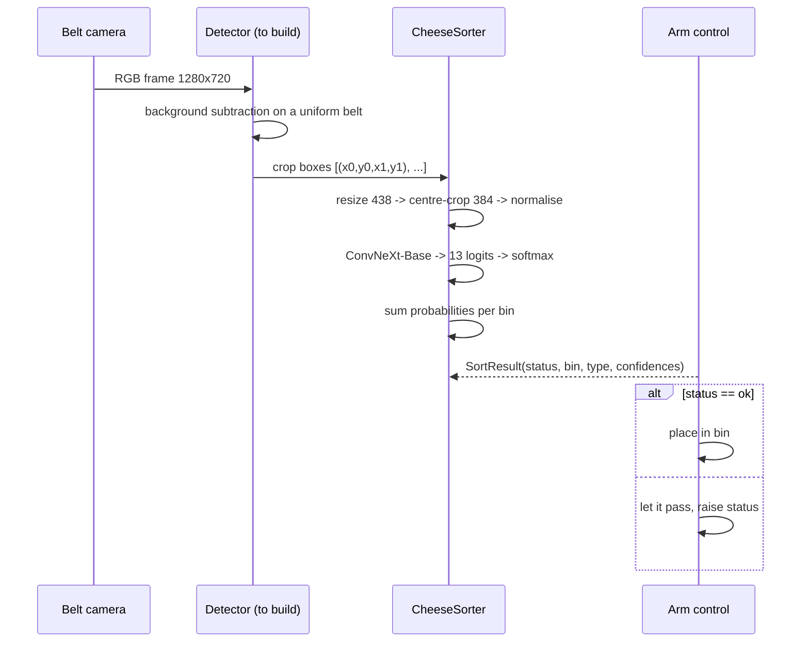
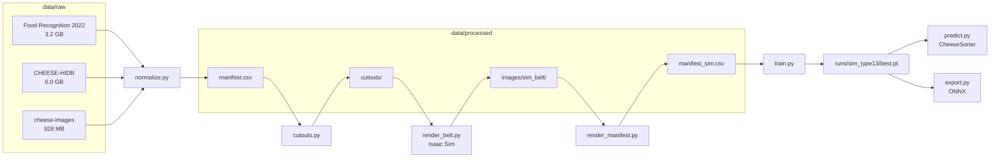

# System architecture

## Runtime — what happens per frame

> [!tip] The detector is not built yet
> It is the single highest-value addition. The classifier is trained on framed pieces;
> feeding it a whole belt frame loses the pixels that separate `bin_semi_hard` from
> `bin_hard`. See [[Robot pipeline]].

## Training — what produced the model

## Design choices worth knowing

| choice | why | detail |
|---|---|---|
| one model, not two | the bins are a strict grouping of the types | [[Probability marginalisation]] |
| reject as classes, not a threshold | a threshold cannot say *why* it is unsure | [[Reject classes]] |
| split by object, not by file | the same wheel in train and test gives a fake 100% | [[Splits and data leakage]] |
| macro-F1 for checkpoints | classes are imbalanced 18:1 | [[Evaluation protocol]] |
| render in Isaac, not 2D compositing | reusable once real 3D assets exist | [[Decision log]] |
