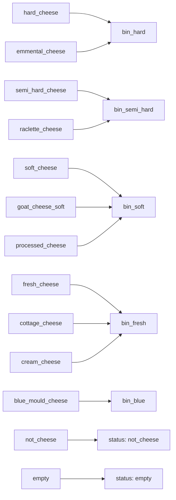

# Class taxonomy

![[classes-13.png]]

## The 13 classes the shipped model predicts

| class | bin it maps to | renders |
|---|---|---|
 | `hard_cheese` | `bin_hard` | 2915 |
| `emmental_cheese` | `bin_hard` | 230 |
| `semi_hard_cheese` | `bin_semi_hard` | 905 |
| `raclette_cheese` | `bin_semi_hard` | 725 |
| `soft_cheese` | `bin_soft` | 1545 |
| `goat_cheese_soft` | `bin_soft` | 620 |
| `processed_cheese` | `bin_soft` | 160 |
| `fresh_cheese` | `bin_fresh` | 645 |
| `cottage_cheese` | `bin_fresh` | 865 |
| `cream_cheese` | `bin_fresh` | 490 |
| `blue_mould_cheese` | `bin_blue` | 445 |
| `not_cheese` | `— reject —` | 1910 |
| `empty` | `— reject —` | 900 |

![[class-distribution.png]]

> [!warning] Imbalance is 18:1
> `hard_cheese` has 2,915 renders, `processed_cheese` has 160. This is inherited from
> Food Recognition and was **not** corrected: no balanced sampler, no class weights.
> Changing that together with the domain would have made every comparison
> uninterpretable — see [[Decision log]].
>
> The consequence is measurable: `processed_cheese` is never predicted correctly.

## The bins

The 5 bins are a **strict partition** of the 11 cheese types. That is what allows one
model to answer both questions — see [[Probability marginalisation]].

## Classes deliberately dropped

| dropped | why |
|---|---|
| `cheese` (generic) | too vague to name a bin |
| `cheesecake` | a cake, not cheese to sort |
| `quiche-with-cheese-baked-with-puff-pastry` | a dish |
| `sandwich-ham-cheese-and-butter` | a dish |
| `risotto-without-cheese-cooked` | contains no cheese |
