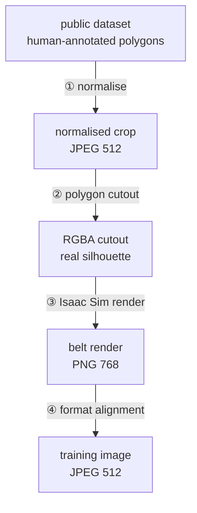

# Data provenance

> [!abstract] Where every training pixel comes from, and why each transformation exists.
> Start here if you are wondering "why does the data look like this?"

**No image was hand-labelled for this project.** Every label rides for free from a public
dataset that was already annotated, through four transformations.

## Traced on one real piece

| stage | artefact |
|---|---|
| original photo | `data/raw/food-recognition-2022/training/img/158517.jpg` |
| annotator's class | `hard_cheese` → bin `bin_hard` |
| instance in the file | object #N of that photo's polygon list |
| normalised crop | `images/food_recognition/hard_cheese/00097992f9de7f56.jpg` |
| RGBA cutout | `cutouts/bin_hard/00097992f9de7f56.png` |
| belt render | `images/sim_belt/bin_hard/bin_hard__00097992f9de7f56__v0.jpg` |

The chain is **reversible**: `extra.object_index` points back to the exact object in the
original Supervisely JSON, so any training image can be traced to the human who drew its
outline.

## Why each step exists

### ① Normalisation — three sources disagree on everything
Different resolutions, orientations, colour spaces, and three incompatible label spaces.
[[Normalisation]] unifies the pixels and **deliberately not** the labels.
Long side 512 rather than 224: keeps headroom for `RandomResizedCrop` without storing
full-resolution files.

### ② Cutouts — a rectangle in a plate is not a piece of cheese
The crops are rectangles containing the cheese *plus its surroundings*. The polygon
becomes the alpha channel. See [[Cutouts]].

### ③ Render — the training domain was wrong
Models were first trained on photographs of cheese on plates and boards. The belt camera
sees none of that. See [[Isaac Sim rendering]].
*Why 5 views:* viewpoint invariance. *Why not 20:* more angles add no new cheese.
*Why elevation ≥ 45°:* at grazing angles a flat decal reads as paper.

### ④ Format alignment — a comparison needs one variable
Renders were 768 px PNG, the real-photo baseline 512 px JPEG. Comparing across that
would mix domain change with resolution and compression change. Converted to 512 px
JPEG q92. **Not** done for speed — training is GPU-bound. Side benefit: 3.6 GB → 311 MB.

## What travels alongside the pixels

| manifest field | why it exists |
|---|---|
| `src_path` | the original file, for tracing back |
| `crop_box` | where in the original photo the instance was |
| `extra.object_index` | which annotated object it is |
| `extra.official_split` | the challenge's own split, for reference |
| **`group`** | the physical object — **the split key**, see [[Splits and data leakage]] |
| `content_hash` | de-duplication |
| `extra.azimut` / `elevation` | the render viewpoint |

![[before-after.png]]
