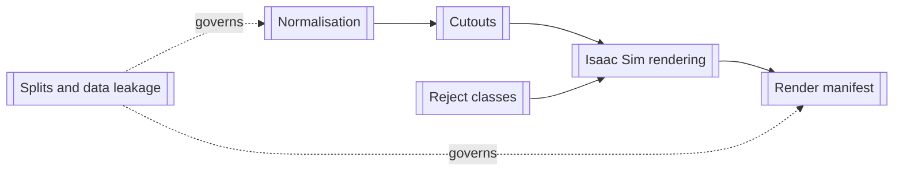

# Pipeline — map of content

| note | what it covers |
|---|---|
| [[Normalisation]] | three sources → one format and one manifest |
| [[Cutouts]] | polygons → RGBA silhouettes, and the negatives |
| [[Isaac Sim rendering]] | the USD scene, domain randomisation, throughput |
| [[Reject classes]] | `empty` and `not_cheese`, and what they cost |
| [[Render manifest]] | renders → training manifest, JPEG conversion |
| [[Splits and data leakage]] | **the rule that governs all of it** |
