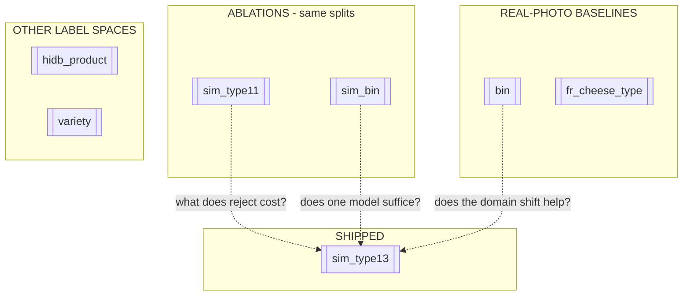

# Models — map of content

Eight heads were trained. **One is shipped.**

| head | classes | trained on | role | test top-1 |
|---|---|---|---|---|
| **[[sim_type13]]** | 13 | belt renders | **ship** | **0.728** |
| [[sim_type11]] | 11 | belt renders | ablation: cost of reject | 0.679 |
| [[sim_bin]] | 5 | belt renders | ablation: is one model enough | 0.763 |
| [[bin]] | 5 | real photos | baseline | 0.789 |
| [[fr_cheese_type]] | 12 | real photos | baseline | 0.591 |
| [[hidb_product]] | 3 | wheel photos | other label space | 0.758 |
| [[variety]] | 288 | web photos | other label space | 0.524 |
| `sim_type` | 11 | belt renders | **superseded**, old splits | — |

> [!danger] These top-1 values are NOT comparable to each other
> Different tasks, different class counts, different test sets. Only [[Model comparison]]
> puts matched pairs side by side.

![[all-models.png]]
