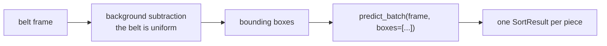

# Robot pipeline recommendations

## 1 — Detect and crop before classifying

> [!important] The highest-value change, and it is architectural

`semi_hard_cheese` → `hard_cheese` is the dominant real error (41% of that class,
different bins). What separates them is paste grain, and in a full belt frame the piece
is too small to keep those pixels.

`predict_batch(frame, boxes=[...])` already expects exactly this. See
[[Confusion analysis]].

## 2 — React to the status, not just the bin

Four outcomes, four behaviours — [[Output contract]]. Note the asymmetry measured in
[[Reject performance]]: a foreign object entering a food bin is the expensive error, and
it is the weaker direction (0.828 recall).

## 3 — Tune the threshold on cost, not accuracy

| threshold | pieces sorted | of which correct |
|---|---|---|
| 0.5 | 87.8% | 84.6% |
| 0.7 | 71.7% | 87.2% |
| 0.9 | 32.9% | 93.0% |

A wrong bin versus a missed cycle is an operations decision.

## 4 — `warmup()` at startup

~50 ms first call versus ~14 ms steady state.

## 5 — Fine-tune on real sim frames as soon as they exist

Everything above assumes renders resemble the demo scene. That assumption is untested —
[[Open questions]].
